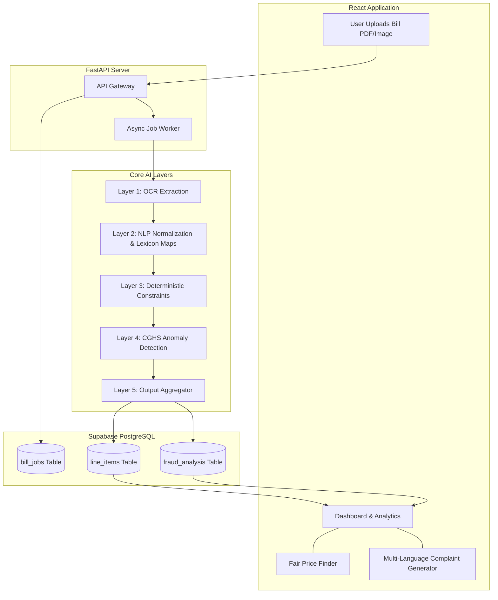

# 🛡️ BillGuard AI

<div align="center">
  <h3>Intelligent Hospital Billing Fraud Detection System</h3>
  <p>Protecting patients from medical billing fraud using OCR, NLP, and Statistical Anomaly Detection.</p>
</div>

---

## 📖 Overview

**BillGuard AI** is a powerful automated pipeline designed to audit unstructured hospital bills, detect massive overcharges, and evaluate medical fraud risk. By leveraging cloud OCR, heuristic NLP parsing, and a custom 5-layer deterministic and statistical rules engine, BillGuard flags predatory pricing against the **Central Government Health Scheme (CGHS) 2024** benchmark rates. 

With an integrated React dashboard, users can confidently upload their bills, view an interactive breakdown of fair market prices, and instantly generate a multi-lingual legal dispute letter if they have been overcharged.

---

## ✨ Key Features

- **📄 Unstructured Bill Ingestion**: Automatically extracting raw text from messy, unstructured medical receipts and invoices using Cloud OCR APIs.
- **🧠 5-Layer AI Fraud Analysis**:
  1. **OCR Data Extraction** (Structured Text Recovery)
  2. **NLP Heuristic Parser** (Extracting medical items & filtering metadata)
  3. **Deterministic Rules Engine** (Detecting logical impossibilities, e.g. Maternity charges for Male patients)
  4. **Statistical Benchmarking** (Comparing itemized rates to CGHS p75 thresholds)
  5. **Fraud Risk Aggregator** (Generating a 0-100 severity score)
- **⚖️ Multi-Lingual Legal Complaints**: Instantly generate formal dispute letters in English, Hindi, Marathi, Tamil, Telugu, Bengali, and Kannada for direct escalation to hospital administrators and consumer courts.
- **🔍 Fair Price Finder**: A searchable, responsive database of accurate benchmark pricing across major medical procedures.
- **🔐 Secure & Persistent**: Powered by Supabase PostgreSQL with robust Row Level Security (RLS) ensuring all patient audit data is private and encrypted.

---

## 🏗️ Architecture Flow



---

## 🛠️ Tech Stack

**Front-End**
- **React 18** (Vite build system)
- **Tailwind CSS** (for highly responsive, modern glass-morphism designs)
- **Lucide React** (Iconography)
- **Recharts** (Data Visualization)

**Back-End**
- **Python 3.10+ / FastAPI** (High-performance API routing and async workers)
- **SQLAlchemy & Asyncpg** (ORM and Database Drivers)
- **TheFuzz / FuzzyWuzzy** (Fuzzy string matching & NLP Lexicons)
- **OCR.space Cloud API** (Optical Character Recognition Engine)

**Infrastructure**
- **Supabase / PostgreSQL** (Primary Relational Database & Authentication)

---

## 📂 File Organization

### `/backend`
- `main.py` - Core FastAPI server, router setups, and Legal Complaint generator (with multilanguage support).
- `queue_worker.py` - Async worker that sequentially executes the 5-layer AI Pipeline.
- `database.py` & `models.py` - Supabase SQLAlchemy async session settings and database table schemas.
- `layers/` - Core Machine Learning and Data Parsing pipeline.
  - `ocr_engine.py` (Layer 1) - Calls out to OCR.space APIs.
  - `nlp_parser.py` (Layer 2) - Regex heuristic extraction blocking bad metadata (GST/dates) and recovering pricing gaps.
  - `normalization.py` (Layer 2.5) - Extensive Lexicon lookups (RADIOLOGY, PHARM_GEN, etc.)
  - `rules.py` (Layer 3) - Hard deterministic validation constraints.
  - `anomaly.py` (Layer 4) - CGHS p75 percentile thresholds.
  - `score_aggregator.py` (Layer 5) - Compiles final 0-100 score.
- `tariff/` - Embeds `cghs_rates.json`, the source-of-truth pricing config.

### `/frontend`
- `src/App.jsx` - Dynamic routing (React Router) with auth guards.
- `src/pages/`
  - `Dashboard.jsx` - Real-time polling and visualization of the fraud score and line items.
  - `History.jsx` - Past audits logs pulled directly from Supabase.
  - `ComplaintLetter.jsx` - UI to switch between 7 Indian languages and export `.docx` disputes.
  - `Pricing.jsx` - "Fair Price Finder" rendering benchmark cards.
- `src/index.css` - Custom styling tokens and Tailwind directives.

---

## 🚀 Local Development Setup

### 1. Database Configuration
1. Create a Supabase project.
2. Obtain your `SUPABASE_URL` and `SUPABASE_KEY`.
3. Add these credentials to `/frontend/.env`.
4. Obtain your direct PostgreSQL connection string (Transaction Pooler). Add it to `/backend/.env` as `DATABASE_URL`.

### 2. Backend Startup
```bash
cd backend
python -m venv venv
source venv/bin/activate  # (or `venv\Scripts\activate` on Windows)
pip install -r requirements.txt
uvicorn main:app --reload
```
*Note: The backend will automatically provision all necessary database tables on launch via `metadata.create_all()`.*

### 3. Frontend Startup
```bash
cd frontend
npm install
npm run dev
```

The application will be accessible at `http://localhost:5173`.

---

## ⚖️ Disclaimer
*BillGuard AI is a proof-of-concept tool designed for educational and analytical purposes during a hackathon context. It fundamentally relies on heuristic analysis and is not a substitute for certified medical coding audits or licensed legal counsel.*
